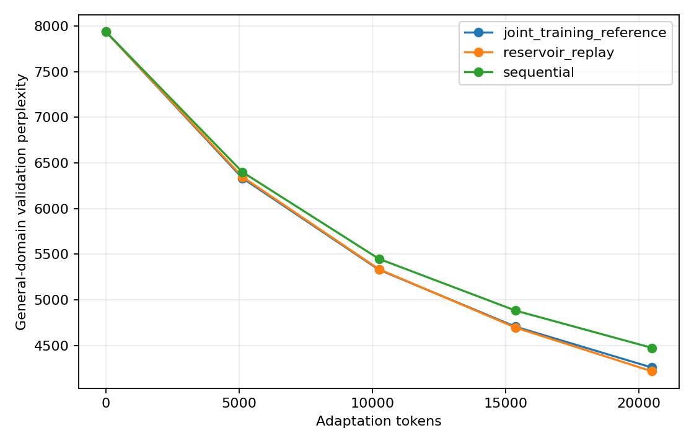
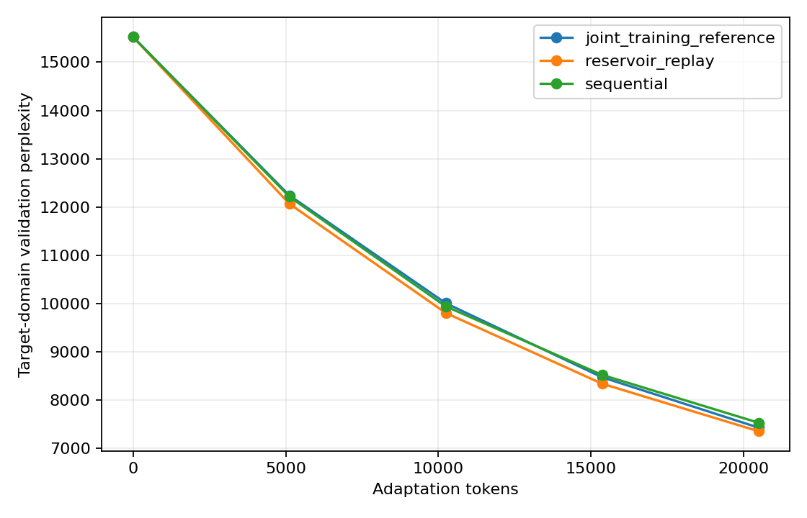

# jax-language-model-lab

A small decoder-only Transformer implemented in JAX and Flax. The repository contains a reproducible pretraining loop and a controlled continual-pretraining experiment.

The experiment asks:

> Can replay reduce catastrophic forgetting during continual pretraining under a fixed token budget?

## Results

The recorded runs use Python 3.10.11, JAX 0.6.2, the CPU backend and one seed (`42`). The model has 3,320,128 parameters.

### Pretraining

The model was trained for 100 steps on a 2,000-document subset of WikiText-2 raw. The checkpoint was then resumed to step 110.

| Checkpoint | Validation loss | Validation perplexity |
| --- | ---: | ---: |
| Step 0 | 10.8411 | 51,075.04 |
| Step 100 | 9.1276 | 9,205.44 |
| Step 110 after resume | 8.9792 | 7,936.39 |

The tiny overfit test reduced loss from `2.0787` to `0.0009` in 100 steps on a four-example synthetic dataset.

### Continual pretraining

The initial checkpoint is the same for every strategy. The adaptation budget is 20,480 tokens with batch size 4 and sequence length 64. Reservoir replay uses 20% replay tokens. The joint-training run uses an 80/20 target/general mixture.

`forgetting` is defined as:

```text
F_t = L_general,t - L_general,0
```

Positive values indicate an increase in general-domain loss. The current single-seed run does not show forgetting: general-domain loss decreased during adaptation, likely because the base model is still small and undertrained.

| Strategy | General PPL | Target PPL | Forgetting |
| --- | ---: | ---: | ---: |
| Sequential | 4,474.44 | 7,534.90 | -0.5731 |
| Reservoir replay | 4,217.56 | 7,358.84 | -0.6322 |
| Joint-training reference | 4,258.46 | 7,433.48 | -0.6226 |

The curves are generated from `results/continual/metrics.jsonl`:





These are exploratory results from one seed. They are not a statistical comparison.

### Precision benchmark

The available device is a CPU, so BF16 was not executed. The recorded FP32 smoke benchmark used the tiny configuration for three timed steps:

| Precision | Backend | Tokens/sec | Peak device memory |
| --- | --- | ---: | --- |
| FP32 | CPU | 25,072.48 | Not exposed by the device |

On a GPU or TPU, `scripts/benchmark_precision.py` runs FP32 and BF16 when the backend supports it.

## Model

The model is a pre-norm decoder-only Transformer with:

- Learned token and positional embeddings.
- Causal self-attention.
- Two-layer GELU MLP blocks.
- Layer normalization and residual connections.
- Tied input embeddings and language-model head.
- Cross-entropy loss with an explicit token mask.

JAX transformations are used in the training path through `jax.jit` and `jax.value_and_grad`. Flax provides module structure and Optax provides the optimizer and gradient clipping.

The tokenizer is the fixed GPT-2 tokenizer downloaded through Hugging Face Transformers. It is not retrained between domains.

## Data

The general corpus is WikiText-2 raw. The target corpus is AG News.

```text
data/raw/wikitext/train.jsonl
data/raw/wikitext/validation.jsonl
data/raw/ag_news/train.jsonl
data/raw/ag_news/validation.jsonl
```

The download script removes exact duplicate validation documents from the training split. Validation documents are never added to the reservoir or the joint-training reference. Raw files are ignored by Git.

WikiText is published under CC BY-SA 4.0. The AG News dataset card describes research and non-commercial use but does not state a standard license. Check the upstream terms before reusing the AG News experiment outside this repository. Manifests record the source and the license note.

## Continual-pretraining setup

The initial general-domain checkpoint is evaluated without adaptation as the `no-adaptation` reference. The other runs start from exactly the same checkpoint and keep the following fixed:

- Model parameters and tokenizer.
- Optimizer and learning-rate schedule.
- Batch size and sequence length.
- Domain order.
- Total adaptation tokens.
- Evaluation schedule.

Reservoir sampling uses Algorithm R. The buffer is built online from general-domain training blocks before adaptation, has capacity 256, and is not updated during adaptation. Each replay batch samples uniformly from the stored buffer.

Metrics are recorded at 0%, 25%, 50%, 75% and 100% of the adaptation budget. Each run stores its configuration, seed, environment information and JSONL metrics.

## Reproducing the runs

Install the package and development tools:

```bash
python -m pip install -e ".[dev]"
```

Run the tests and lint:

```bash
python -m pytest
ruff check .
```

Run the mandatory tiny overfit:

```bash
python scripts/tiny_overfit.py
```

Download the local dataset subsets used in the recorded run:

```bash
python scripts/download_data.py --max-train-documents 2000 --max-validation-documents 500
```

Run general-domain pretraining. The `--total-steps` override is useful for a short local run; the configuration keeps a longer schedule available for adaptation:

```bash
python scripts/train.py --config configs/real.yaml --total-steps 100 --output results/pretrain_reproduction
```

Resume that run:

```bash
python scripts/train.py --config configs/real.yaml --total-steps 110 --output results/pretrain_reproduction --resume
```

Run the continual experiment from the resumed checkpoint:

```bash
python scripts/run_continual.py --config configs/real.yaml --pretrain-output results/pretrain_reproduction --output results/continual_reproduction
```

Generate plots from an existing metrics file:

```bash
python scripts/plot_results.py results/continual_reproduction/metrics.jsonl --output results/continual_reproduction/figures
```

Run the precision benchmark:

```bash
python scripts/benchmark_precision.py \
  --config configs/tiny.yaml \
  --steps 3 \
  --warmup-steps 1
```

The GPT-2 tokenizer and public datasets are downloaded on first use. Checkpoint directories are intentionally ignored by Git; metrics, configurations and figures are small enough to review and commit.

## Limitations

- The recorded runs use one CPU device and one seed.
- The model and token budget are deliberately small.
- The general-domain model is undertrained, so the current adaptation run does not produce a forgetting regime.
- AG News has an upstream non-commercial-use caveat and is not redistributed here.
- No distributed, TPU, CUDA or BF16 result is claimed from this environment.
